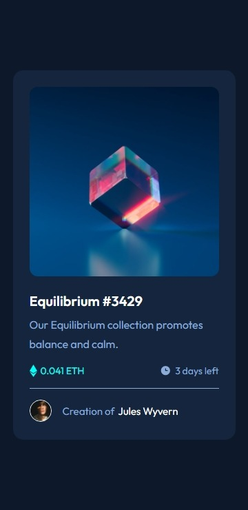
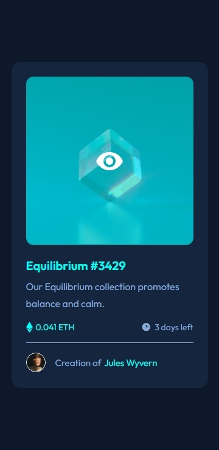
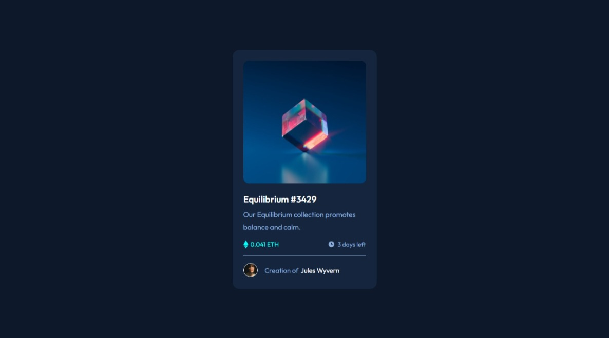
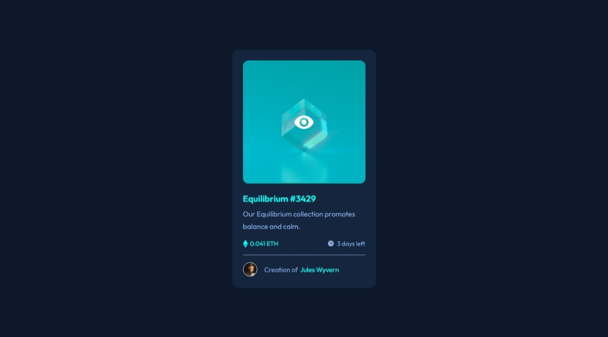

# Frontend Mentor - NFT preview card component solution

This is a solution to the [NFT preview card component challenge on Frontend Mentor](https://www.frontendmentor.io/challenges/nft-preview-card-component-SbdUL_w0U). Frontend Mentor challenges help you improve your coding skills by building realistic projects. 

## Table of contents

- [Overview](#overview)
  - [The challenge](#the-challenge)
  - [Screenshots](#screenshots)
  - [Links](#links)
- [My process](#my-process)
  - [Built with](#built-with)
  - [What I learned](#what-i-learned)
  - [Continued development](#continued-development)
  - [Useful resources](#useful-resources)
- [Author](#author)
- [Acknowledgments](#acknowledgments)

## Overview

### The challenge

Users should be able to:

- View the optimal layout depending on their device's screen size
- See hover states for interactive elements

### Screenshots

#### Mobile

#### Desktop

## My Process

### Built with

- Semantic HTML markup
- BEM CSS pattern
- Flexbox

### What I learned

This project made me practice the fundamentals of web development again, using only HTML and CSS. Several concepts were remembered during the design stage of the project and, although not all of them were applied here, it was very good to remember my first contacts with this universe.

The main lessons I take with me after this project are a set of best practices for developing web pages, such as semantic HTML markup and class definition with the BEM CSS pattern, in addition to a better mastery of the Flexbox technique.

### Continued development

In the future, I intend to better understand the use of better tools and frameworks to facilitate and speed up my development. Some of the technologies I look forward to are:

- Syntactically Awesome Style Sheets (SASS)
- ReactJS

### Useful resources

- [A metodologia BEM para a criação de códigos legíveis](https://www.maujor.com/tutorial/metodologia-bem-para-criar-codigo-legivel.php) - This article was very useful to better understand the concept, and consequently the application, of this convention.
- [HTML Semântico: Conheça os elementos semânticos da HTML5](https://www.devmedia.com.br/html-semantico-conheca-os-elementos-semanticos-da-html5/38065) - Because of this guide I got a list of the most common/used semantic HTML tags.

## Author

## Acknowledgments

- [CodeAgam](https://www.youtube.com/channel/UC9zuvRD2wSdGN8cHFYRGSSg) = Inspiration to refactor the code.